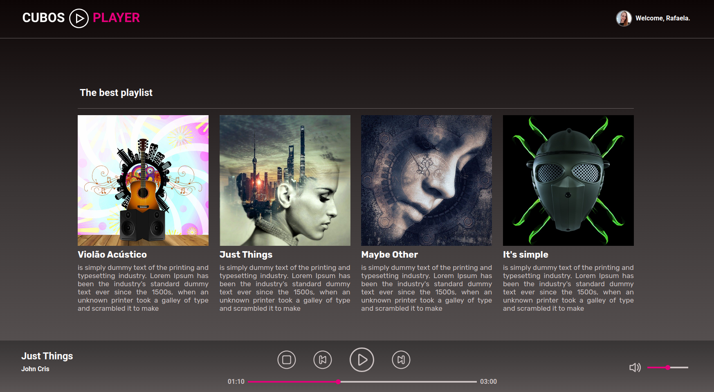

<p align="center">
    
</p>

<p align="center">
  

  
  
  <a href="https://github.com/rafawessling/module3_react_project/commits/main">
    
  </a>

   <a href="https://www.linkedin.com/in/rafaela-wessling/">
    
   </a>
</p>

<p align="center">
    
</p>

<p align="center">
    
</p>

> This project consists of developing a music player using _React, JavaScript, HTML, and CSS_.
> It is based on the following layout on <a href="https://www.figma.com/file/2RRh9uG0Mjj6p4p6ekVnNp/Cubos-Player?node-id=0%3A1" target="_blank">Figma</a>.

-   The project is available on this <a href="https://cubos-player.onrender.com" target="_blank">link</a>.

> To begin with, choose the song you want to listen to or click on the play button to start by the first song on the playlist.
> Use the buttons to stop, play the previous song, pause or play, and play the next song, respectively.
> Utilize the bar and the icon on the bottom right to control the volume or mute the song.

##

### Index

1. [About the project](#about)
2. [How to execute](#how-to-execute)
3. [Technologies](#technologies)
4. [Author](#author)
5. [License](#license)

##

<div id='about'></div>

### 1. About the project

This project was developed during the Full Stack Software Development course at <a href="https://github.com/cubos-academy" target="_blank">@cubosacademy</a>.
It was bootstrapped with <a href="https://create-react-app.dev/" target="_blank">Create React App</a>.

##

<div id='how-to-execute'></div>

### 2. How to execute

-   Firstly, install the following tools: <a href="https://git-scm.com" target="_blank">Git</a>, <a href="https://nodejs.org/en/" target="_blank">Node.js</a>.

-   Clone this repository:

    ```
    $ git clone git@github.com:rafawessling/module3_react_project.git
    ```

-   Access the project folder on the terminal/cmd:
    ```
    $ cd module3_react_project
    ```
-   Install the dependencies:
    ```
    $ npm install
    ```
-   Execute the application:

    ```
    $ npm start
    ```

    The server will run on port: 3000 → Access: <a href="http://localhost:3000" target="_blank">http://localhost:3000</a>.

##

<div id='technologies'></div>

### 3. Technologies

In this project, the following technologies are used:

##### Website:

-   React
-   JavaScript
-   Node
-   HTML
-   CSS

##### Utility:

-   Git and GitHub
-   Figma
-   Editor: Visual Studio Code
-   Fonts: Roboto, Rubik

##

<div id='author'></div>

### 4. Author

👩🏼‍💻 <a href="https://www.linkedin.com/in/rafaela-wessling/" target="_blank">Rafaela Wessling Oening</a>

-   **How to contribute to the project:**

1. _Fork_ the project;
2. Create a _new branch_:
    ```
    $ git checkout -b my-feature
    ```
3. Save your changes and _commit_ it:
    ```
    $ git commit -m "feat: Added new feature"
    ```
4. _Submit_:
    ```
    $ git push origin my-feature
    ```

##

<div id='license'></div>

### 5. License

Developed by Rafaela Wessling Oening. <a href="https://www.linkedin.com/in/rafaela-wessling/" target="_blank">Reach out!</a>

##

###### tags: `module 3` `front-end` `React`
